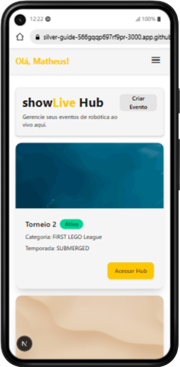
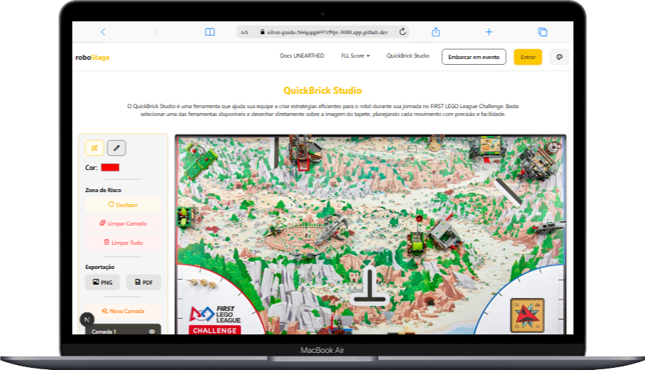

# <div align="center">🤖 Robo<span style="color:#e63946">Stage</span></div>

<div align="center">

Plataforma completa para equipes, técnicos, juízes e organizadores da <strong>FIRST LEGO League Challenge (FLLC)</strong>.
Gerencie torneios, documente robôs, planeje estratégias e acompanhe tudo em tempo real.

<a href="https://robo-stage.vercel.app/"><strong>🌐 Acessar Plataforma</strong></a> • <a href="https://github.com/ohthias/roboStage/releases">📦 Releases</a> • <a href="https://github.com/ohthias/roboStage/issues">🐞 Issues</a>


</div>

# ✨ Visão Geral

O **roboStage** foi criado para conectar todos os elementos da FLL — do planejamento do robô às apresentações, dos testes ao torneio final.
Um ecossistema completo que une tecnologia, estratégia e inovação em uma única plataforma.

Ele é projetado para:

- Técnicos que buscam ferramentas sólidas
- Equipes que precisam de organização
- Juízes que necessitam de precisão
- Organizadores que querem automação e fluxos mais rápidos

# 🧰 Ferramentas Oficiais do roboStage

Cada ferramenta foi criada para uma etapa fundamental da temporada — do técnico ao projeto de inovação.

## ⚙️ QuickBrick Studio

**Simule, documente e planeje seu robô.**

O **QuickBrick Studio** é o núcleo técnico da plataforma.
Ele permite que sua equipe **visualize, documente e planeje** a engenharia do robô com eficiência.

### Recursos:

* Criação de diagramas estruturados
* Registro de mecanismos, motores e sensores
* Simulação de estratégias e movimentos
* Histórico de versões e evolução do robô

> Ideal para documentar o robô na temporada **FLL CHALLENGE – UNEARTHED!**

---

## 🧪 LabTest

**Teste e valide suas execuções com precisão.**

O **LabTest** transforma treino em dados.
A ferramenta registra execuções e gera **estatísticas completas** para decisões mais inteligentes.

### Recursos:

* Registro individual de tentativas
* Estatísticas automáticas de desempenho
* Comparação entre estratégias
* Identificação de padrões, erros e estabilidade

> Uma ferramenta indispensável para equipes que levam melhoria contínua a sério.

---

## 💡 InnoLab

**Organize e visualize todo o Projeto de Inovação.**

O **InnoLab** ajuda sua equipe a estruturar o caminho do Projeto de Inovação de forma clara e criativa.

### Recursos:

* Criação de diagramas temáticos
* Mapeamento visual de problema, solução e impacto
* Exportação para PDF e apresentações
* Trabalho colaborativo entre membros da equipe

> Perfeito para equipes que desejam clareza e uma apresentação impecável.

---

# 📸 Demonstrações


*Dashboard com visão geral dos torneios criados.*


*Ferramenta de criação de estratégia de mesa*

---

# 🛠 Tecnologias Utilizadas

* **Next.js** — Fullstack completo
* **React** — Interface reativa e modular
* **TailwindCSS + DaisyUI** — Estilização rápida e elegante
* **Supabase** — Banco, autenticação e real time
* **Vercel** — Hospedagem e deploy contínuo
* **Lucide Icons** — Ícones modernos e leves

---

# 🧪 Como Rodar Localmente

```bash
# Clone o repositório
git clone https://github.com/ohthias/roboStage.git

# Acesse a pasta
cd roboStage

# Instale dependências
npm install

# Configure as variáveis do Supabase
cp .env.local

# Execute o servidor
npm run dev
```

Abra:
👉 [http://localhost:3000](http://localhost:3000)

---

# 📄 Licença

Distribuído sob a **MIT License**.
Consulte o arquivo [LICENSE](LICENSE) para mais detalhes.

---

# 🙏 Créditos

* Ícones: Flaticon / Freepik
* UI: DaisyUI
* Desenvolvimento: **Matheus (ohthias)**
* Comunidade FLL que contribui diariamente com feedbacks

---

# 📬 Suporte

* GitHub: [https://github.com/ohthias/roboStage](https://github.com/ohthias/roboStage)
* Reportar problemas: [https://github.com/ohthias/roboStage/issues](https://github.com/ohthias/roboStage/issues)